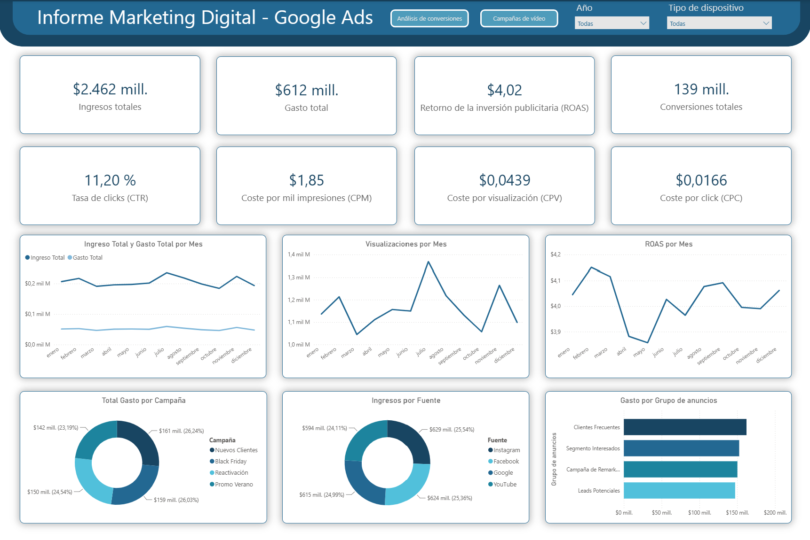
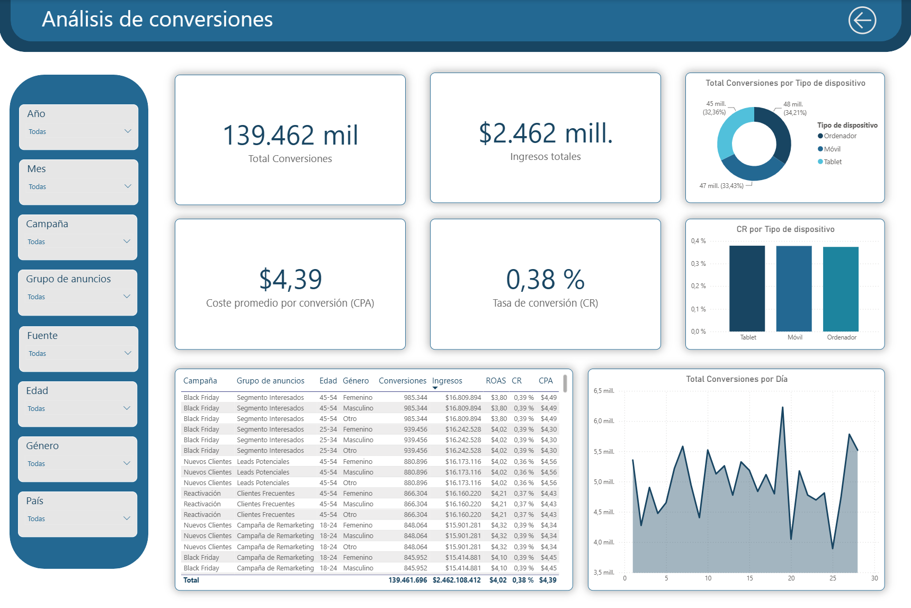
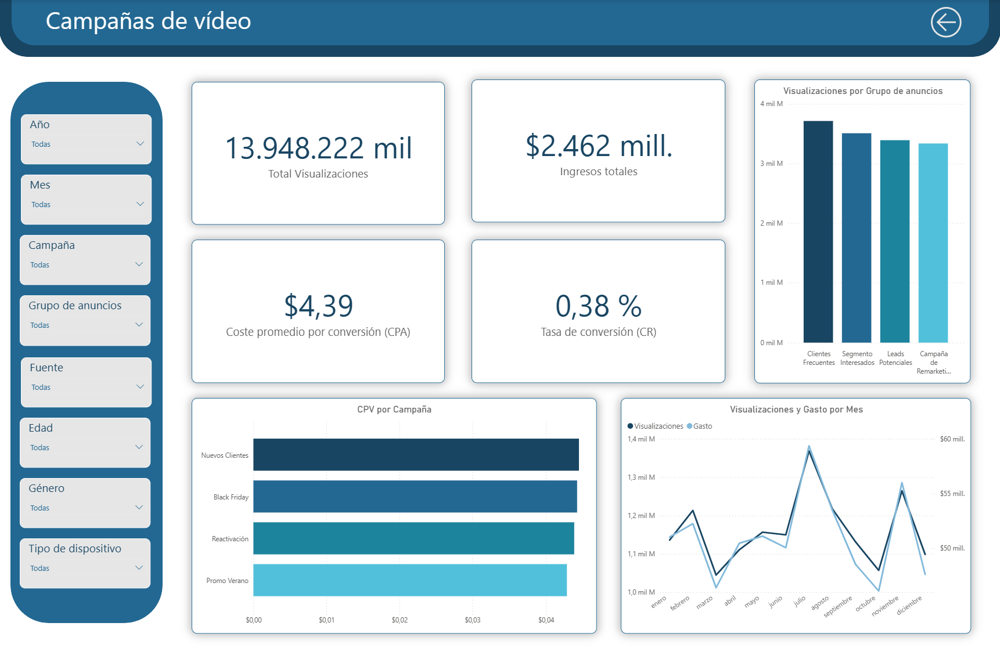

# Google Ads Digital Marketing & Conversion Dashboard

## Project Overview
This project is a comprehensive Business Intelligence dashboard built in Microsoft Power BI to analyze digital marketing performance, ad spend efficiency, and user conversion metrics for Google Ads campaigns. 

The dashboard is structured into a multi-page report designed to track high-level executive KPIs as well as granular data such as device performance, demographic breakdowns, and video campaign metrics, empowering data-driven marketing decisions.

---

## Dashboard Views & Features

### 1. Executive Overview
* **Key Metrics (KPI Cards):** Total Revenue, Total Ad Spend, Return on Ad Spend (ROAS), Total Conversions, Click-Through Rate (CTR), Cost Per Impression (CPM), Cost Per View (CPV), and Cost Per Click (CPC).
* **Trend Analysis:** Line charts tracking Revenue vs. Spend, Views, and ROAS across months.
* **Campaign & Source Breakdown:** Donut charts and bar charts analyzing performance distribution by campaign types and traffic sources (Instagram, Facebook, Google, YouTube).

### 2. Conversion Analysis
* **Granular Filtering:** Dedicated side-panel slicers for Year, Month, Campaign, Ad Group, Source, Age, Gender, and Device Type.
* **Detailed Matrix Table:** A structured data table combining campaign segments, demographics, conversions, revenue, ROAS, Conversion Rate (CR), and Cost Per Acquisition (CPA).
* **Device & Daily Trends:** Breakdown of conversions by device type (Desktop, Mobile, Tablet) and daily conversion fluctuations.

### 3. Video Campaigns Performance
* **Video Metrics:** Focused tracking on total video views, cost per view (CPV) by campaign, and monthly views vs. spend correlation.
* **Ad Group Insights:** Bar charts comparing performance across different targeting groups.

---

## Tools & Technologies Used
* **Microsoft Power BI:** Data modeling, DAX measures, interactive filtering, and custom multi-page UI design.
* **Excel / Power Query:** Data source preparation, cleaning, and structuring.
* **Data Visualization Best Practices:** Clean card layouts, consistent color palettes matching corporate themes, and intuitive navigation buttons between pages.

---

## Key Business Insights
* Evaluated ad spend efficiency by tracking ROAS and CPA to identify top-performing marketing campaigns.
* Analyzed user behavior across different demographic segments and devices to optimize future budget allocations.

---
**Contact:** [My linkedin profile](https://www.linkedin.com/in/adoram-valerón-suárez-041196341)
